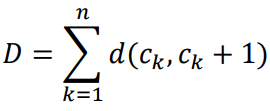
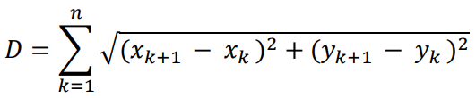
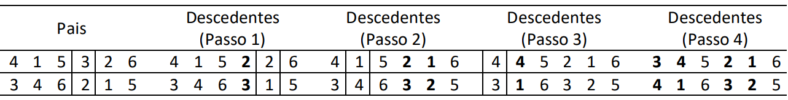

# Inteligência Artificial - Trabalho 02

Fundação da Universidade Regional de Blumenau

Alunos: 
* Francisco Lucas Sens
* William Lopes da Silva

Nas últimas aulas estudamos que um agente baseado em objetivo em um ambiente adequadamente definido pode atingir seu objetivo através de algoritmos de busca. Para utilizar uma estratégia de busca, precisamos:
* Definir o estado objetivo (por exemplo, estar em Bucareste)
* Definir o problema:
  * Definir o estado inicial (por exemplo, em Arad)
  * Definir as ações válidas (por exemplo, dirigir de uma cidade à outra)
  
Vimos que o algorítmo genético é uma variante de Busca Local em que é mantida uma grande população de estados. Novos estados são gerados por mutação e por crossover, que combina pares de estados da população.

Este trabalho discute a implementação do algoritmo genético baseado no caso do **Caixeiro Viajante** .

Assumimos que há um caixeiro-viajante que precisa visitar **n** cidades através do caminho mais curto possível. Ele visita cada cidade exatamente uma vez, em seguida, retorna para a cidade onde ele começou. Portanto, uma solução seria uma lista de todas as cidades na ordem que ele as visita: como Cidade 1, Cidade 2,..., Cidade n; onde a cidade 1 é o seu estado inicial. Assim, os cromossomos para o algoritmo genético serão diferentes permutações dos números inteiros de 1 a n.

Há muitas variações do problema caixeiro-viajante, mas para este trabalho faremos as seguintes suposições:
* Consideramos 20 cidades que são representadas por números aleatórios entre (0,0) e (1,1) em um plano quadrado 1 x 1 (x-y).
* Os cromossomos são números inteiros de 1 a 20.
* Supomos que as n cidades são listados na ordem c1 → c2 → ... → cn num dado cromossomo.
* Partindo do princípio que estamos tentando minimizar a distância total que o caixeiroviajante percorre, a função de aptdão (fitness) será a distância total D:

onde a cidade n+1 = Cidade 1 (estado inicial). Se (xi, yi) são as coordenadas da cidade ci, então a função de aptidão (fitness) é:

* Assumimos que a distância **d** da cidade **c**i para a cidade **c**j é: **d (ci, cj) = d (cj, ci)** para todo **i** ∈ **[1, n]** e **j** ∈ **[1, n]**.
  * OBS.: alguns casos do mundo real isso não seria verdade: o caminho em uma direção pode ser um pouco mais longo do que o caminho de volta, ou pode custar mais para dirigir nas subidas do que nas descidas.
* O tamanho da população é 20 e o número de interações é 10.000.
* Para construir as gerações subsequentes, mantemos a metade da população atual e geramos a outra metade da nova geração por meio da seleção e do crossover. Lembre-se que o operador de seleção escolhe apenas a fração da população que é mantida.
* Para determinar a distribuição do conjunto de cromossomos que serão escolhidos para a reprodução, calculamos a probabilidade, na qual distribuimos os valores inversamente (visto que organizamos os cromossomos em ordem crescente do mais apto ao menos apto).
* Para selecionar os cromossomo, utilizamos o método da roleta.
* Como no nosso caso o agente visita somente uma vez cada cidade, utilizaremos para fazer a Recombinação (crossover) a técnica de “cycle” (exemplo na Figura 1), onde:
  * Escolhemos um local aleatório dentro do cromossomo.
  * Passo 1: Os dois cromossomos pais trocam os números inteiros neste local para gerar os descendentes.
  * A menos que os números trocados tenham o mesmo valor, cada descendente terá um número duplicado.
  * Passo 2: Em seguida, mudamos o número duplicado da primeira descendência com o mesmo local do número da segunda descendência.
  * Passo 3 e 4: Isto significa que temos agora outro número duplicado, então repita este processo até não terem mais números duplicados.
  
Figura 1: Exemplo de Recombinação Cycle

  * O operador de mutação escolhe aleatoriamente dois números inteiros em um cromossomo da nova geração e os troca. O operador de mutação atua sobre cada membro da nova geração com probabilidade de 0,05.
  
No final, mostre os resultados na janela de comando:
* Tamanho da Populacao
* Taxa de Mutacao
* Numero de Cidades
* Melhor Custo
* Melhor Solucao

Utilize também a função Plot para mostrar os pontos e o melhor caminho encontrado pelo Algoritmo Genético.

## Observações:
* Por favor, não esqueça de comentar suas linhas de código (explicações simples são suficientes).
* Você pode trabalhar em grupos. Neste caso, me envie apenas uma versão para todo o grupo, especificando também os nomes de todos os outros colegas.
  * T2_Aluno1_Aluno2_Aluno3.zip ou .py
